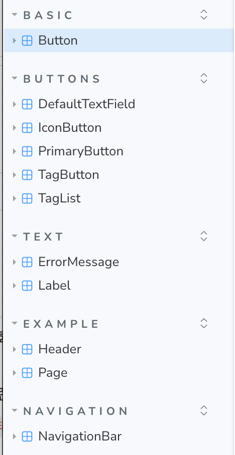
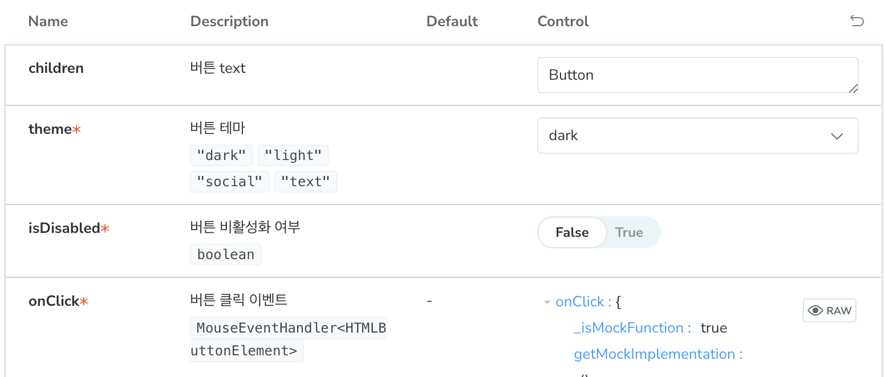

# 스토리북이란

## 스토리북 사용에 따른 기대효과

- 서비스 UI에 일관성 부여
- 코드 및 디자인의 유지보수 유리함
- 기획 ↔ 디자이너 ↔ 개발자 간의 커뮤니케이션 비용 개선 가능

## TailwindCss + Storybook 조합 사용

```jsx
/** @type {import('tailwindcss').Config} */
export default {
  content: ["./index.html", "./src/**/*.{js,jsx,ts,tsx}"],
  theme: {
    extend: {},
    borderRadius: {
      "primary-button": "5px",
      "tag-button": "17.5px",
    },
    fontFamily: {
      body: ["Noto Sans KR"],
    },
    fontSize: {
      xs: [
        "12px",
        {
          lineHeight: "18px",
          letterSpacing: "0",
          fontWeight: "400",
        },
      ],
      sm: [
        "14px",
        {
          lineHeight: "21px",
          letterSpacing: "0",
          fontWeight: "400",
        },
      ],
      base: [
        "16px",
        {
          lineHeight: "24px",
          letterSpacing: "0",
          fontWeight: "400",
        },
      ],
      xl: ["20px", "30px"],
      "2xl": [
        "24px",
        {
          lineHeight: "36px",
          letterSpacing: "0",
          fontWeight: "700",
        },
      ],
    },
    colors: {
      primary: "#1d2745",
      secondary: "#1de5d4",
      tertiary: "#f52c50",
      white: "#ffffff",
      mono100: "#f1f1f1",
      mono200: "#bebebe",
      mono300: "#d6d7d9",
      error: "#d01e1e",
      social: "#395997",
      "dark-opacity": "rgba(255, 255, 255, 0.1)",
    },
  },
  plugins: [],
};

```

## 컴포넌트 개발과 스토리 작성

- meta로 보는 스토리 정보
    
    ```jsx
     const meta = {
      title: "Basic/Button", // 경로를 지정함(아래 이미지 참조)
      component: Button,       // 해당 스토리가 사용하는 컴포넌트
      parameters: {            // 스토리북 웹에서 스토리를 어떻게 보여줄지. 
        layout: "centered",    // 3가지 옵션이 있는데 `centered`가 가장 보기 좋음
      },
      tags: ["autodocs"],      // 설명을 보여주는 방법. 굳이 수정할 필요 없음
      argTypes: {              // 컴포넌트가 받는 prop들에 대한 설명 + 설정
        backgroundColor: { control: "color", description: "버튼의 배경 컬러" },
      },
    } satisfies Meta<typeof Button>;
    ```
    

- 경로
    
    
    

- `argTypes` 를 상세히 작성할수록 소통에 유리함
    - `description`과 `control`이 가장 중요
        
        
        
    - `description`은 아래 문서 참고할것
        
        [ArgTypes • Storybook docs](https://storybook.js.org/docs/api/arg-types#controltype)