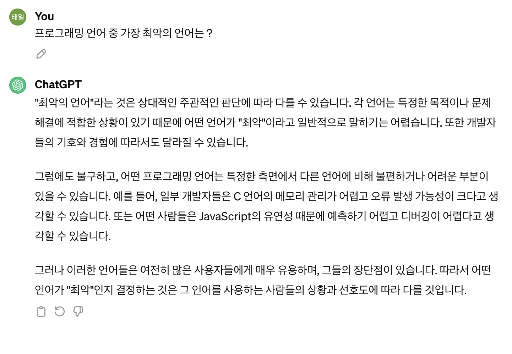

# 프론트엔드 테스트

## 프론트엔드에도 반드시 테스트를 해야하는 이유

사실 프론트엔드가 본격적으로 하나의 ‘직종’이라고 불리우게 된것은 2013년 ‘React’가 나오고, NPM(Node Package Manager)가 가속화되면서 모듈 형식으로 가져와 쓸 수 있게 된 수준 부터라고 볼 수 있다. 기존 프론트엔드에서 가장 많은 작업을 차지 했던건 html + css 로 화면단을 구성하는 퍼블리셔 작업이 main이었다면 이제 점점 화면에서의 실시간성의 중요성이 대두되면서 데이터를 최소로 호출하고 호출한 데이터를 최대한 화면단에 적절히 뿌려주는 작업이 중요시되고 프레임워크도 이에 따른 작업이 원할하게 돌아갈 수 있도록 발전이 되가고 있다.

즉, 데이터를 어떻게 관리하고 이를 UI와 구분되는 intent성 비즈니스 로직을 얼만큼 원할하게 가져가는가(이는 유지보수할 때 극명하게 구분된다)가 중요성이 강조되고 있다.

지피티도 인정한 자바스크립트의 망할 유연성…..

최근 프론트엔드 공고에는 타입스크립트 사용이 이제 거의 필수로 자리잡고 있다.

왜 ? 

javascript는 너무나도 자유성이 높다. 변수의 타입을 고려하지 않고 단순 `let`, `const` 로 선언 및 초기화 부분만 차별성이 놓이고 이러한 자유도는 데이터 fetching에 있어서 치명적인 오류를 맞이할 수 밖에 없다. (RESTful API 요청 시 서버에서 지정한 형식을 못지킬 가능성 높음) 

따라서 typescript는 javascript의 자유성을 일정 부분 포기하는 대신 프론트엔드 소프트웨어를 더 잘 관리하기 위해서 만들어졌고 실제로 본인도 타입스크립트를 적용하지 않아도 변수 타입, props 타입에 심히 신경을 많이 쓴다.

이렇게 프론트엔드 관리와, 프론트엔드 코드의 퀄리티의 중요성이 상당히 중요시되면서 **프론트엔드 테스팅도 같이 주목받기 시작한다.**

## 왜 코드 관리와 코드 퀄리티 향상을 위해서는 테스트가 필요할까?

### 1. 테스트는 코드가 의도한대로 동작한 다는 것을 보장해 준다.

코드 작성 후 손으로 하나하나 동작을 확인하다보면 확인하지 못한 기능이 있을 수 있다. 그러나 정해진 시나리오에 맞춰 테스트를 진행한다면, 모든 시나리오가 완료되면 코드도 의도한 기능대로 동작한다는 걸 보장할 수 있다.

그러나 처음 코드를 작성할 때 보다 유지 보수 및 기능 수정시 테스트는 더욱 더 큰 역할을 한다. 개발을 하다보면 코드를 개선하기 위해서 리팩토링을 하거나, 기능 수정을 위해 코드를 변경하는 경우가 적지 않게 존재한다. (사실 기능 구현보다는 만들었던 기능을 다듬는 유지보수가 더 많다.)

### 2. 코드를 수정할 때 테스트가 존재하지 않는다면 코드 수정시 발생할 수 있는 사이드이펙트(의도치 않은 버그나 오류)를 알 수 없다.

사실 사이드이펙트 가능성에 대해서는 알 수 있긴 하다. 하나씩 바꿔보고 바로 실행시켜보면 확인이 가능하다. 하지만 이는 그냥 단순한 기능을 수반하는 작은 애플리케이션일때만 수월하고, 만약에 하나의 비즈니스 코드를 여러 구역에서 적용한다고 했을때의 사이드이펙트는 쉽게 확인이 가능하지 않다. 

**때문에 개발자들은 기존에 동작하고 있는 코드를 수정하기 꺼려하고, 기존의 코드를 리팩토링해서 사용하기 보다는 중복된 기능을 가진 코드를 생성하는 것을 선호하게 된다.** 

허나 이러한 작업이 반복되고 수정 요청이 끊이지 않는다면? ****해당 프로젝트에는 중복되는 코드와 나쁜코드가 점점 더 쌓이기만 하고 결국 프로젝트는 회생불가능한 상태에 이르게 된다. 프론트엔드는 점점 기능이 많아지고 복잡해지고 있다. 테스트가 가능한 환경을 미리 만들어서 수정된 기획에 맞춰가는 형식을 갖추자 !

## 유닛테스트, 통합테스트, e2e 테스트

프론트엔드를 테스트하기 위해서 어떤 테스트를 적용해야 할까? 구글링을 통한 테스는 크게 3가지(유닛테스트, 통합테스트, e2e 테스트)가 나온다. 각각의 특징을 알아보자.

### 유닛테스트

- 코드의 Unit단위를 테스트 한다. 프론트엔드 코드에서 유닛은 단일 컴포넌트나 단일 서비스가 될 수 있다.
- 프로젝트의 **제일 작은 단위를 테스트하기 때문에 모든 시나리오를 테스트할 때 테스트의 양이 가장 적다.**(효율적임!)
- TDD 사용시 가장 작은단위 부터 기능대로 동작하는지 확인하면서 개발하기 좋다.
- **소프트웨어의 구조가 명확하지 않고, 단일 유닛의 기능이 자주 변경되는 환경에서는 테스트가 자주 변경되어야 하고 이는 테스트 작성의 효율을 떨어뜨리기 때문에 도전적인 프로젝트에 사용하는 것은 추천하지 않는다.**
    
    → Unit 단위로 요구사항을 테스트하는데 잦은 리팩토링으로 Unit이 변경된다면 이때마다 테스트를 변경해야만 한다. 소프트웨어의 구조가 명확한 프로젝트에서 사용하는 것이 추천된다.
    
- **별도의 통합이 필요없기 때문에 백엔드 API가 구현이 안되어도 작성할 수 있다.**

### 통합테스트

- 통합된 기능을 테스트한다. 유닛테스트가 단일 컴포넌트나 단일 서비스를 기준으로 테스트를 했다면, 유닛들 간의 데이터를 주고받는 환경을 테스트한다.
- 통합테스트 전략에 따라 프론트엔드 전체 유닛들만 통합하여 테스트하거나, 백엔드와 데이터베이스까지 전체를 통합해서 테스트하는 경우도 있다.
- **전체 유닛의 상호작용에 대해서 테스트가 가능하다.**

### e2e 테스트

- **e2e테스트는 end to end**의 약자로, **소프트웨어의 가장 끝단인 사용자로부터 가장 끝단인 백엔드 인프라까지 테스트하는 것을 의미**한다.
- e2e테스트는 cypress, playwright 등의 도구를 통해 브라우저 동작을 자동화하여 테스트를 진행한다.
- 주로 유저 스토리를 기반의 시나리오를 기반으로 테스트를 진행한다.
- **사용자 관점에서 전체 시나리오를 테스트하기 때문에 코드의 변경에도 테스트를 변경할 필요가 없다.**
- **다른 테스트와 달리 전체 시나리오를 테스트하기 때문에 소프트웨어의 무결성을 보장하기 가장 좋다.**
- **사용자 관점에서 전체 시나리오를 테스트하기 위해선 굉장히 많은 테스트가 필요하다.**
- **프론트엔드만 따로 테스트하는 것이 불가능하며, 백엔드와의 통합이 필요하다.**
- **전체 테스트를 하는데 시간이 오래 걸려 자주 테스트하기 어렵다.**

각각의 테스트는 따로 사용하기도 같이 사용하기도 한다. 특히 유닛 테스트와 통합 테스트는 React-Testing-Library와 같이 동시에 지원하는 툴이 많기 때문에 전략에 따라 섞어서 사용하기도 한다.